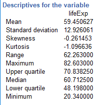
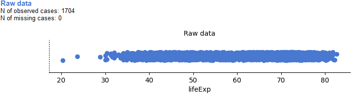
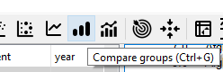
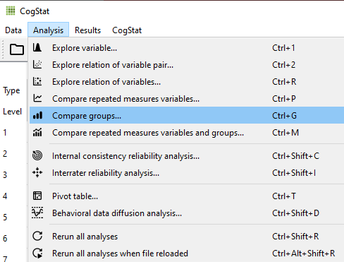
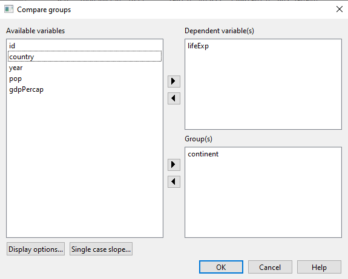
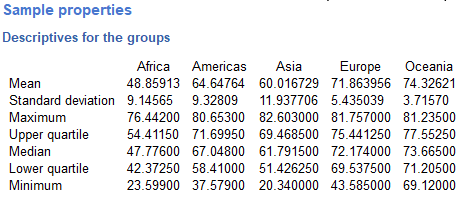
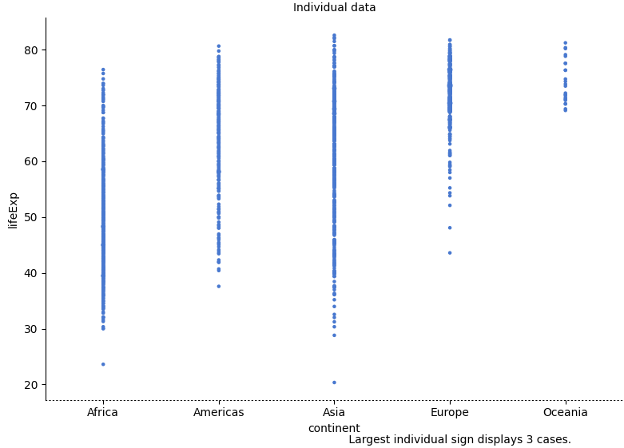

# Lab 2: Descriptive Statistics

```{=html}
<script>
$("#coverpic").hide();
</script>
```
[Describing comic sensibility is near impossible. It's sort of an abstract silliness, that sometimes the joke isn't the star. ---Dana Carvey]{.newthought}

The purpose of this lab is to show you how to compute basic descriptive statistics, including measures of central tendency (mean, mode, median) and variation (range, variance, standard deviation).

## General Goals

1.  Compute measures of central tendency using software
2.  Compute measures of variation using software
3.  Ask some questions of a data set using descriptive statistics

### Important info

We will be using data from the gapminder project. You can download a small snippet of the data in .csv format from this link (note this dataset was copied from the gapminder library for R) <a href="https://raw.githubusercontent.com/CrumpLab/statisticsLab/master/data/gapminder.csv" download>gapminder.csv</a>. If you are using R, then you can install the gapminder package. This method is described later in the R section.

## R

### Descriptives basics in R

We learned in lecture and from the textbook that data we want to use ask and answer questions often comes with loads of numbers. Too many numbers to look at all at once. That's one reason we use descriptive statistics. To reduce the big set of numbers to one or two summary numbers that tell use something about all of the numbers. R can produce descriptive statistics for you in many ways. There are base functions for most of the ones that you want. We'll go over some R basics for descriptive statistics, and then use our new found skills to ask some questions about real data.

#### Making numbers in R

In order to do descriptive statistics we need to put some numbers in a variable. You can also do this using the `c()` command, which stands for combine

```{r}
my_numbers <- c(1,2,3,4)
```

There a few other handy ways to make numbers. We can use `seq()` to make a sequence. Here's making the numbers from 1 to 100

```{r}
one_to_one_hundred <- seq(1,100,1)
```

We can repeat things, using rep. Here's making 10 5s, and 25 1s:

```{r}
rep(10,5)
rep(1,25)
all_together_now <- c(rep(10,5),rep(1,25)) 
```

#### Sum

Let's play with the number 1 to 100. First, let's use the `sum()` function to add them up

```{r}
one_to_one_hundred <- seq(1,100,1)
sum(one_to_one_hundred)
```

#### Length

We put 100 numbers into the variable `one_to_one_hundred`. We know how many numbers there are in there. How can we get R to tell us? We use `length()` for that.

```{r}
length(one_to_one_hundred)
```

### Central Tendency

#### Mean

Remember the mean of some numbers is their sum, divided by the number of numbers. We can compute the mean like this:

```{r}
sum(one_to_one_hundred)/length(one_to_one_hundred)
```

Or, we could just use the `mean()` function like this:

```{r}
mean(one_to_one_hundred)
```

#### Median

The median is the number in the exact middle of the numbers ordered from smallest to largest. If there are an even number of numbers (no number in the middle), then we take the number in between the two (decimal .5). Use the `median` function. There's only 3 numbers here. The middle one is 2, that should be the median

```{r}
median(c(1,2,3))
```

#### Mode

R does not a base function for the Mode. You would have to write one for yourself. Here is an example of writing your own mode function, and then using it. Note I searched how to do this on Google, and am using the mode defined by [this answer on stack overflow](https://stackoverflow.com/questions/2547402/is-there-a-built-in-function-for-finding-the-mode)

Remember, the mode is the most frequently occurring number in the set. Below 1 occurs the most, so the mode will be one.

```{r}

my_mode <- function(x) {
  ux <- unique(x)
  ux[which.max(tabulate(match(x, ux)))]
}

my_mode(c(1,1,1,1,1,1,1,2,3,4))


```

### Variation

We often want to know how variable the numbers are. We are going to look at descriptive statistics to describe this such as the **range**, **variance**, the **standard deviation**, and a few others.

First, let's remind ourselves what variation looks like (it's when the numbers are different). We will sample 100 numbers from a normal distribution (don't worry about this yet), with a mean of 10, and a standard deviation of 5, and then make a histogram so we can see the variation around 10..

```{r}
sample_numbers <- rnorm(100,10,5)
hist(sample_numbers)
```

#### range

The range is the minimum and maximum values in the set, we use the `range` function.

```{r}
range(sample_numbers)
```

#### var = variance

We can find the sample variance using `var`. Note, divides by (n-1)

```{r}
var(sample_numbers)

```

#### sd = standard deviation

We find the sample standard deviation us SD. Note, divides by (n-1)

```{r}
sd(sample_numbers)
```

Remember that the standard deviation is just the square root of the variance, see:

```{r}
sqrt(var(sample_numbers))
```

#### All Descriptives

Let's put all of the descriptives and other functions so far in one place:

```{r}
sample_numbers <- rnorm(100,10,5)

sum(sample_numbers)
length(sample_numbers)
mean(sample_numbers)
median(sample_numbers)
my_mode(sample_numbers)
range(sample_numbers)
var(sample_numbers)
sd(sample_numbers)

```

### Descriptives by conditions

Sometimes you will have a single variable with some numbers, and you can use the above functions to find the descriptives for that variable. Other times (most often in this course), you will have a big data frame of numbers, with different numbers in different conditions. You will want to find descriptive statistics for each the sets of numbers inside each of the conditions. Fortunately, this is where R really shines, it does it all for you in one go.

Let's illustrate the problem. Here I make a date frame with 10 numbers in each condition. There are 10 conditions, each labelled, A, B, C, D, E, F, G, H, I, J.

```{r}
scores <- rnorm(100,10,5)
conditions <- rep(c("A","B","C","D","E","F","G","H","I","J"), each =10)
my_df <- data.frame(conditions,scores)
```

If you look at the `my_df` data frame, you will see it has 100 rows, there are 10 rows for each condition with a label in the `conditions` column, and 10 scores for each condition in the `scores` column. What if you wanted to know the mean of the scores in each condition? You would want to find 10 means.

The slow way to do it would be like this:

```{r}
mean(my_df[my_df$conditions=="A",]$scores)
mean(my_df[my_df$conditions=="B",]$scores)
mean(my_df[my_df$conditions=="C",]$scores)
# and then keep going
```

Nobody wants to do that! Not, me I stopped doing it that way, you should to.

#### group_by and summarise

We can easily do everything all at once using the `group_by` and `summarise` function from the `dplyr` package. Just watch

```{r}
library(dplyr)

my_df %>%
  group_by(conditions) %>%
  summarise(means = mean(scores))

```

A couple things now. First, the print out of this was ugly. Let's fix that. we put the results of our code into a new variable, then we use `knitr::kable` to print it out nicely when we `knit` the document

```{r}

summary_df <- my_df %>%
               group_by(conditions) %>%
               summarise(means = mean(scores))

knitr::kable(summary_df)

```

#### multiple descriptives

The best thing about the `dplyr` method, is that we can add more than one function, and we'll get more than one summary returned, all in a nice format, let's add the standard deviation:

```{r}

summary_df <- my_df %>%
               group_by(conditions) %>%
               summarise(means = mean(scores),
                         sds = sd(scores))

knitr::kable(summary_df)

```

We'll add the min and the max too:

```{r}

summary_df <- my_df %>%
               group_by(conditions) %>%
               summarise(means = mean(scores),
                         sds = sd(scores),
                         min = min(scores),
                         max = max(scores))

knitr::kable(summary_df)

```

### Describing gapminder

Now that we know how to get descriptive statistics from R, we cam do this will some real data. Let's quickly ask a few question about the gapminder data.

```{r}
library(gapminder)
gapminder_df <- gapminder
```

Note: The above code will only work if you have installed the gapminder package. Make sure you are connected to the internet, then choose the Packages tab from the bottom right panel, and choose install. Thens search for gapminder, choose it, and install it.

#### What are some descriptive for Life expectancy by continent?

Copy the code from the last part of descriptives using `dplyr`, then change the names like this:

```{r}

summary_df <- gapminder_df %>%
               group_by(continent) %>%
               summarise(means = mean(lifeExp),
                         sds = sd(lifeExp),
                         min = min(lifeExp),
                         max = max(lifeExp))

knitr::kable(summary_df)

```

### Generalization Exercise

(1 point - Pass/Fail)

Complete the generalization exercise described in your R Markdown document for this lab.

1.  What is the mean, standard deviation, minimum and maximum life expectancy for all the gapminder data (across all the years and countries). Hint: do not use `group_by`

2.  What is the mean, standard deviation, minimum and maximum life expectancy for all of the continents in 2007, the most recent year in the dataset. Hint: add another pipe using `filter(year==2007) %>%`

### Writing assignment

(2 points - Graded)

Complete the writing assignment described in your R Markdown document for this lab. When you have finished everything. Knit the document and hand in your stuff (you can submit your .RMD file to blackboard if it does not knit.)

Your writing assignment is to answer these questions in full sentences using simple plain langauge:

1.  Define the mode.
2.  Explain what would need to happen in order for a set of numbers to have two modes
3.  Define the median
4.  Define the mean
5.  Define the range
6.  When calculating the standard deviation, explain what the difference scores represent
7.  Explain why the difference scores are squared when calculating the standard deviation
8.  If one set of numbers had a standard deviation of 5, and another had a standard deviation of 10, which set of numbers would have greater variance, explain why.

**Rubric**

General grading.

-   You will receive 0 points for missing answers (say, if you do not answer question c, then you will receive 0 out .25 points for that question)
-   You must write in complete sentences. Point form sentences will be given 0 points.
-   Completely incorrect answers will receive 0 points.
-   If your answer is generally correct but very difficult to understand and unclear you may receive half points for the question

## Excel

How to do it in Excel

## SPSS

In this lab, we will use SPSS to calculate a variety of descriptive statistics. SPSS allows us to specify which statistics we would like calculated and produce them all in one output table. Here, we will learn to:

1.  Calculate descriptive statistics
2.  Graph data using a histogram
3.  Editing graphs

Let's begin with a short data set {x= 1, 1, 4, 1, 2, 5, 7}

Suppose we want to calculate the measures of central tendency (mean, median, and mode) as well as variability (range, standard deviation, and variance). First, we will have to enter our data into the SPSS spreadsheet. There are 7 measurements, so we will need 7 rows of data (I have also changed the name of this variable in Variable View to `x`:

```{r , echo=FALSE,dev='png'}
knitr::include_graphics('img/2.4.11.png')
```

### Calculating Descriptive Statistics

------------------------------------------------------------------------

From here, go to the top menu and choose [Analyze]{style="color:blue"}, then [Descriptive Statistics]{style="color:blue"} and then [Frequencies]{style="color:blue"}:

```{r , echo=FALSE,dev='png'}
knitr::include_graphics('img/2.4.12.png')
```

A new window will ask you to specify for which variables you want descriptives statistics calculated. Use the arrow to move the `x` variable from the left-hand to the right-hand field.

```{r , echo=FALSE,dev='png'}
knitr::include_graphics('img/2.4.13.png')
```

Now, click the [Statistics]{style="color:blue"} button. This will open a new window containing a list of statistics. You can choose as many as you want to be calculated. We will choose [mean, median mode, range, standard deviation, and variance]{style="color:blue"}.

```{r , echo=FALSE,dev='png'}
knitr::include_graphics('img/2.4.14.png')
```

Then click [Continue]{style="color:blue"}, and then [OK]{style="color:blue"}. SPSS will produce a set of two output tables: one containing the descriptive statistics we have chosen, and the other a frequency table--a list of all the possible values in our data set and their corresponding frequencies.

```{r , echo=FALSE,dev='png'}
knitr::include_graphics('img/2.4.15.png')
```

### Descriptive Statistics and Histograms

------------------------------------------------------------------------

Now let's use a real dataset to calculate the same measures of central tendency and variability as in the last example, but with the addition of a histogram to visualize a distribution to relate back to the descriptive statistics. [Here](https://github.com/CrumpLab/statisticsLab/blob/master/data/spssdata/life_expectancy.sav) is a link to the life expectancy dataset we used for our graphing tutorial. It is named life_expectancy.sav.

Suppose we wanted to know about life expectancy (around the world) in 2018. This will include calculating descriptive statistics, as well as graphing a histogram to examine the distribution of our data. SPSS often has neat shortcuts to graph data within other menu options. For example, in the process of asking SPSS to produce a table of descriptive statistics, we can also add a histogram to the output without having to go to the Graphs menu.

First, we go to [Analyze]{style="color:blue"}, then [Descriptive Statistics]{style="color:blue"}, then [Frequencies]{style="color:blue"}.

```{r , echo=FALSE,dev='png'}
knitr::include_graphics('img/2.4.16.png')
```

A window will appear asking us to indicate which variable to use. We will scroll all the way down in the list of variables on the left, choose `2018 [V220]`, and then move it into the field on the right using the arrow.

```{r , echo=FALSE,dev='png'}
knitr::include_graphics('img/2.4.17.png')
```

As in the previous example, we will click the [Statistics]{style="color:blue"} button next, and choose our measures of central tendency [(mean, median, mode)]{style="color:blue"} as well as variability [(range, standard deviation, variance)]{style="color:blue"}.

```{r , echo=FALSE,dev='png'}
knitr::include_graphics('img/2.4.18.png')
```

Once we click continue, we are back to the previous window. Here, we can conveniently ask SPSS to insert a histogram. Let's click on the [Charts]{style="color:blue"} button:

```{r , echo=FALSE,dev='png'}
knitr::include_graphics('img/2.4.19.png')
```

This will open a new window that asks us to specify the type of chart we would like. Let's select [Histogram]{style="color:blue"}, and check off [Show normal curve on histogram]{style="color:blue"}:

```{r , echo=FALSE,dev='png'}
knitr::include_graphics('img/2.4.20.png')
```

Click [Continue]{style="color:blue"}, and then [OK]{style="color:blue"}.

SPSS will produce a table of the requested descriptive statistics, a frequency table (we will ignore this for now because it is long and not relevant to this exercise), and finally, a histogram showing the distribution of life expectancy (in years) with a normal distribution superimposed for comparison.

```{r , echo=FALSE,dev='png'}
knitr::include_graphics('img/2.4.21.png')
```

```{r , echo=FALSE,dev='png'}
knitr::include_graphics('img/2.4.22.png')
```

Something to think about: What do the mean, median, and mode indicate about the shape of the distribution? Is it confirmed when we look at the histogram? How does the shape of this distribution compare to the symmetrical normal distribution which is superimposed over it?

### Editing graphs

------------------------------------------------------------------------

For future reference, we will take this opportunity to make edits to the appearance of this graph. It is helpful to know how to manipulate not just the superficial, cosmetic appearance of data visualizations, but also the components of graphs that communicate important information. One feature to consider is the scale of our axes.

To modify the scale in a graph, first [double-click]{style="color:blue"} on the graph itself in the output window. A Chart Editor should pop up.

```{r , echo=FALSE,dev='png'}
knitr::include_graphics('img/2.4.23.png')
```

Now, hover your mouse over one of the values on the x-axis, and click down once. You will see all the x-axis values suddenly highlight:

```{r , echo=FALSE,dev='png'}
knitr::include_graphics('img/2.4.24.png')
```

Now that you know how to select the entire axis, [double click]{style="color:blue"} on it. A properties window will pop up:

```{r , echo=FALSE,dev='png'}
knitr::include_graphics('img/2.4.25.png')
```

Notice that in the default tab, you can change the fill color of components of your graph. For now, we will select the [Scale]{style="color:blue"} tab instead:

```{r , echo=FALSE,dev='png'}
knitr::include_graphics('img/2.4.26.png')
```

Notice in this tab, we can change the minimum, maximum, and increments of our scale. Lets change the major increment to 5:

```{r , echo=FALSE,dev='png'}
knitr::include_graphics('img/2.4.27.png')
```

Click [Apply]{style="color:blue"}. Then [Close]{style="color:blue"}. Now, close your Chart Editor window by simply [x]{style="color:blue"}-ing it out. The SPSS output window will now contain your edited graph:

```{r , echo=FALSE,dev='png'}
knitr::include_graphics('img/2.4.28.png')
```

### Practice Problems

------------------------------------------------------------------------

1.  Using the life expectancy data set, produce a table of output showing the descriptive statistics (measures of central tendency and variability) for both years 1800 and 1934 (during the Great Depression).

2.  Plot histograms of life expectancy for both years. How are these distributions different? (Hint: Plot these on the same axes so that they are comparable).

## JAMOVI

How to do it in JAMOVI

## CogStat

We already realized, that the data we want to ask questions about often comes with loads of numbers, which is too many to look at all at once. That is one reason we use descriptive statistics, to reduce the big set of numbers to only a few summary numbers, which tell us something about all the original values. Descriptive statistics is a powerful tool, that helps us summarize vast amounts of information to understand our data and its traits better.

In this section data from the gapminder project will be used, so first of all, load the data “Gapminder” into CogStat, as we did it before in the first Chapter.

### Goals

-   Understand the importance of descriptives
-   Run descriptive statistics

### Statistical measurements to describe the data

Measures of Central Tendency (mean, median, mode)

-   Mean: The numbers' mean is their sum, divided by the number of numbers counted.
-   Median: Median is the middle number of all your numbers ordered from smallest to largest.
-   Mode: Mode is the number that occurs most frequently in your dataset.

Measures of Variability (minimum, maximum, range, standard deviation, quartiles): We often want to know how variable the numbers are. Descriptive statistics can describe this such as the range, variance, standard deviation, and a few others.

-   Minimum: The smallest one between your numbers.
-   Maximum: The largest one between your numbers.
-   Range: The difference between your dataset's smallest and largest numbers. (for more: [https://en.wikipedia.org/wiki/Range\_(statistics)](https://en.wikipedia.org/wiki/Range_(statistics)){.uri})
-   Standard deviation: The square root of the variance (the average of squared deviations from the mean). (for more: <https://doc.cogstat.org/Differences-in-calculations-between-CogStat-and-other-programs#standard-deviation-of-the-sample-and-the-population>)
-   Quartiles: It divides the data into four somewhat equal portions.

### What are some descriptives of life expectancy in this dataset?

In this task, we only want to take a look at one variable, life expectancy, and its descriptives. First, load the data “Gapminder”. After loading the data, select “Explore variables”. In the dialogue that appears, choose “LifeExp” from “Available variables” and click “OK”. In the “Descriptives for the variable” table of the Sample Properties section, you find the descriptive statistics of your variable. As you can see, with this task, we got all the descriptives we usually look for and need. According to our output, the mean life expectancy in this dataset is almost sixty years.



It is also very important to look at the minimum and maximum values. In this case, the maximum life expectancy is almost eighty-three years and the minimum is about twenty-four years. It sounds strange, that the minimum life expectancy is barely twenty-four years, right? This is why it is useful to take a look at your dataset and raw data first.



This dataset contains more countries and their life expectancy throughout decades. As data from several countries can be found here, we can find well-developed and under-developed ones, as well as there are years of war, prosperity, or crisis. After this piece of information, it is easier to look at and understand this dataset and the results coming from the analysis.

### What are some descriptives of life expectancy by continent?

Sometimes, you will have a single variable with some numbers, and you can use the steps explained above to find the descriptives for that variable. Other times, you will have a big set of numbers grouped into different conditions or groups. You might want to find descriptive statistics for each set of numbers inside each condition or group.

In this task, we would like to find out the descriptives of the life expectancy for all the continents. What we do here is compare different variables by a single one. In CogStat, choose the “Compare groups” (Ctrl + G) analysis. (Note that, to solve this task you could also choose the “Compare repeated measures variable and groups” analysis [Ctrl + P] as well, as it gives you the same output, only the dialogues differ in these tasks. We choose “Compare groups” here as according to the task it comes more naturally and logically.)



or





After this dialogue appears, select “lifeExp” as Dependent variable(s) and “continent” as “Group(s)”, as we want to know all the continents' life expectancies separately.

In the Sample Properties part of the output, all the descriptives for the groups are provided, which lets us make comparisons about the data.



First, we see the mean life expectancy for continents, and we can say that it is highest in Oceania and Europe, followed by America and Asia, and the lowest is in Africa. As we take a look at the different standard deviations, we see that it is highest in Asia and lowest in Oceania. It means that in Asia there is a bigger difference from the mean, than in Oceania. The table also shows the minimum and maximum life expectancy for each continent, which is quite interesting to look at, since this shows us some really big differences. The median and the upper and lower quartiles also show some important points. For these values, the dataset is in order. The median shows the middle values, for each continent. For example, in Europe, the median is around 72 years, and there is as much higher life expectancy as much lower than this one (as the median is the middle value). Quartiles are values that divide the data points into equal parts of four, with the same number of values. 25% of the data points are under the value of the lower quartile and 75% of the data points are under the value of the upper quartile. For Europeans, the upper quartile is about 75 years, which means that 75% of people cannot expect a life expectancy of 75 years. The lower quartile is around 69 years, which means that only 25% of people can expect a lower life expectancy, but most will probably live longer than that.

Additionally, CogStat also provides us with boxplots to visualize some of the information mentioned before.



To understand the boxplot, take a look at its parts, regarding the data of Africa. Vertically, all the datapoints are represented with little blue dots.


